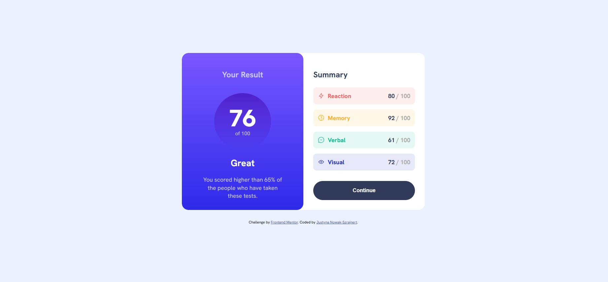
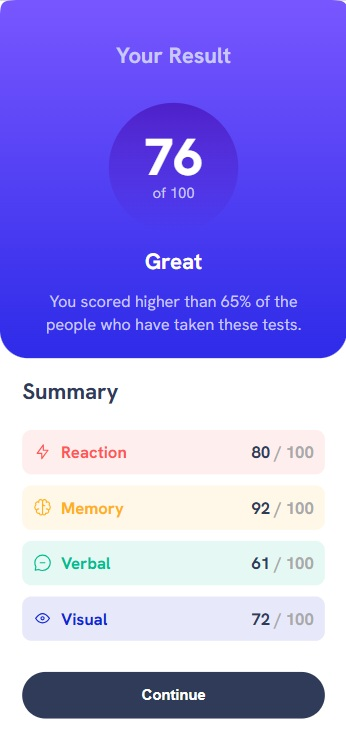

# Frontend Mentor - Results summary component solution

This is a solution to the [Results summary component challenge on Frontend Mentor](https://www.frontendmentor.io/challenges/results-summary-component-CE_K6s0maV). Frontend Mentor challenges help you improve your coding skills by building realistic projects. 

## Table of contents

- [Overview](#overview)
  - [The challenge](#the-challenge)
  - [Screenshot](#screenshot)
  - [Links](#links)
- [My process](#my-process)
  - [Built with](#built-with)
  - [What I learned](#what-i-learned)
  - [Continued development](#continued-development)
  - [AI Collaboration](#ai-collaboration)
- [Author](#author)


## Overview

### The challenge

Users should be able to:

- View the optimal layout for the interface depending on their device's screen size
- See hover and focus states for all interactive elements on the page

### Screenshot

#### Desktop Layout


*The final 2-column desktop view showing the precise visual balance, adjusted circle scale, typography hierarchy, and compressed spacings.*

#### Active States


*The responsive full-width single-column layout optimized for smaller viewports, featuring custom padding adjustments and negative spacing overrides.*


*The responsive full-width single-column layout optimized for smaller viewports, featuring custom padding adjustments and negative spacing overrides.*

### Links

- Solution URL: [Frontend Mentor Solution] ()
- Live Site URL: [GitHub Pages Live Preview](https://jusnow1608.github.io/results-summary-component-main/)

## My process

### Built with

- Semantic HTML5 markup (`<ul>` and `<li>` structure for accessibility)
- CSS Grid (for the main 2-column desktop layout)
- Flexbox (for precise internal alignment of columns)
- Responsive Mobile-first adjustments (`@media` queries)
- Google Fonts (`Hanken Grotesk` configuration with proper font weights: 500, 700, 800)


### What I learned

During this project, I significantly improved my understanding of layout balance and responsive web design. I learned how to use semantic elements like list items for data presentation, which improves accessibility (SEO and screen readers).

```html
<ul class="categories">
  <li class="reaction">
    <div class="category-box">
      
      <p class="category">Reaction</p>
    </div>
    <p class="score"><span>80</span> / 100</p>
  </li>
  </ul>
```

During this challenge, I learned the importance of visual hierarchy and fine-tuning spacing (UI precision). Initially, the component felt too stretched, but by analyzing the original design, I managed to compress the layout and improve text weights to achieve a near "pixel-perfect" match.

One of the key takeaways was fine-tuning the spacing on smaller mobile screens using negative margins inside media queries to achieve a perfect optical balance:

```css
@media (max-width: 600px) {
  .summary {
    padding: 24px;
    gap: 16px;
  }
  
  .summary > h2 {
    margin-top: -4px;    /* Pulls the heading closer to the fiolet box */
    margin-bottom: -4px; /* Eliminates the large gap above the list */
  }
}
```
I also practiced switching container behaviors from `space-between` to `flex-start` combined with `margin-top: auto` to group elements tightly together while pushing the main button elegantly to the bottom:

```css
.summary {
  display: flex;
  flex-direction: column;
  justify-content: flex-start; /* Keeps the heading and list close together */
  gap: 14px;
}

.continue-button {
  margin-top: auto; /* Pushes the button to the absolute bottom of the white card */
}
```
### Continued development

In future projects, I want to focus more on:

- BEM (Block Element Modifier) methodology for cleaner CSS naming conventions.

- Deepening my knowledge of web accessibility (WCAG guidelines).

- Working with JavaScript or JSON files to dynamically update data structures.


### AI Collaboration

I collaborated with Gemini AI as an interactive peer code-reviewer during this project.

- How I used it: I used the AI assistant to review my code structure, debug minor CSS issues (like a sneaky double semicolon), and brainstorm the best layout adjustments for the mobile view.

- What worked well: The collaborative refactoring process was excellent. It helped me transform general <div> structures into highly semantic <ul>/<li> lists and guided me toward creative solutions like using negative margins for precise optical spacing.

## Author

- GitHub - [@Jusnow1608](https://github.com/Jusnow1608)
- Frontend Mentor - [@Jusnow1608](https://www.frontendmentor.io/profile/Jusnow1608)
- LinkedIn - [@Justyna-Nowak-Szrajnert](https://www.linkedin.com/in/justyna-nowak-szrajnert-a5168713b/)

